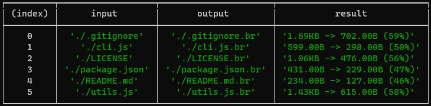

# Brotli + CLI = Brocli
Simple command-line brotli-compressor without dependencies

## Requirements
node >= 12

## Usage

```shell
node cli.js screenshot.png
```


## Tests

```shell
node test/compress.js
```
